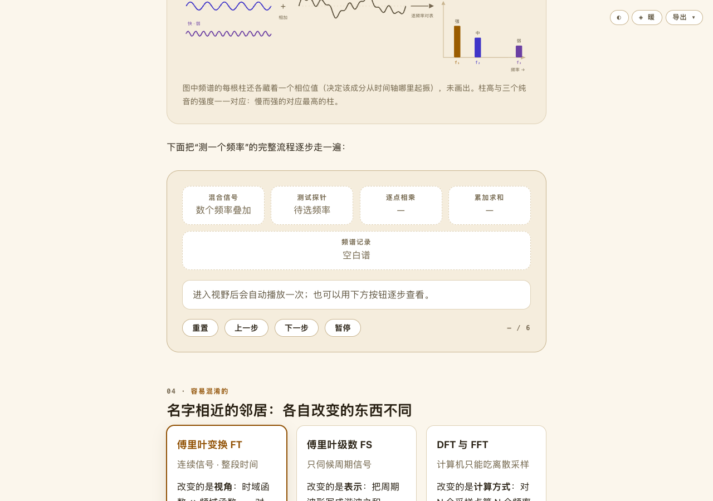
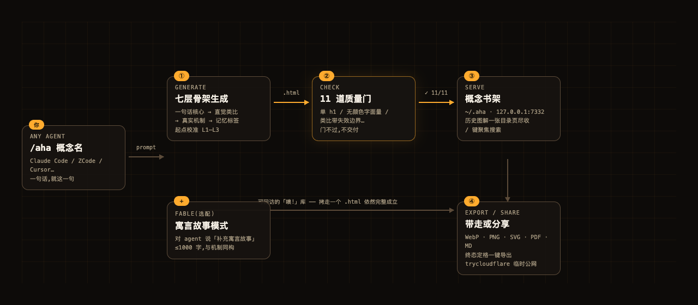
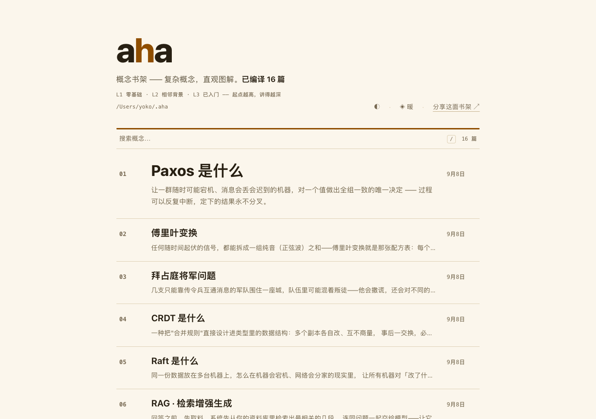
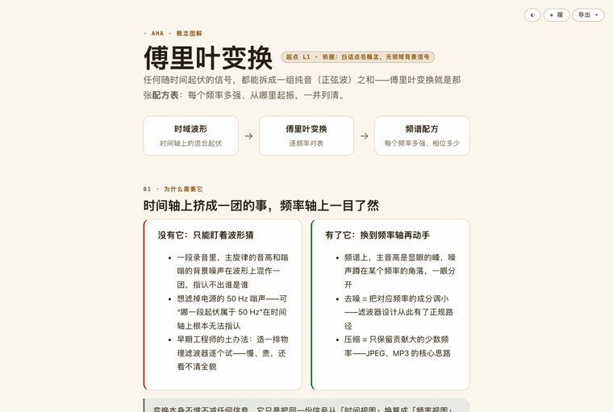
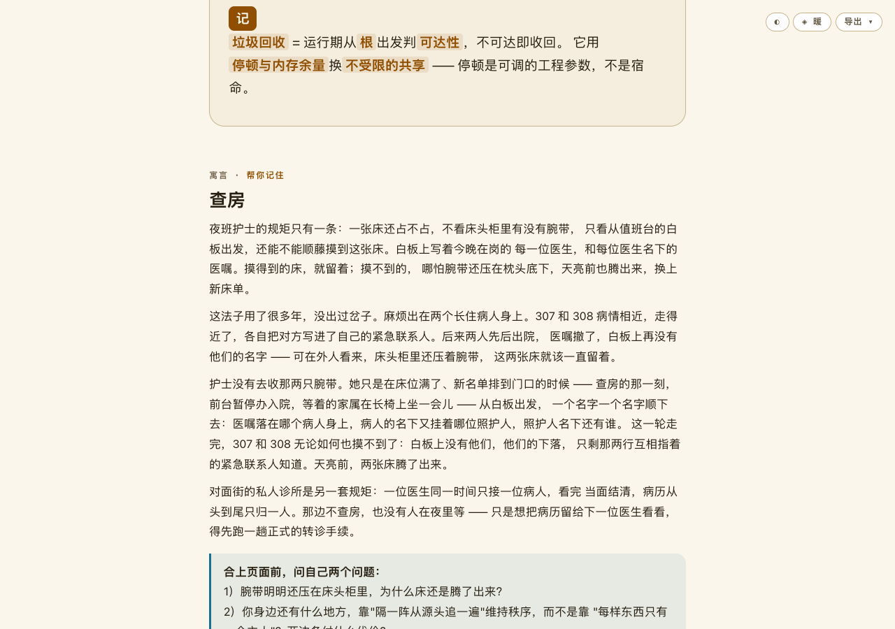

# eli5 火了,产物质量忽高忽低?这个同思路 skill 把质检焊进了流程

> 傅里叶变换、TLS 握手、垃圾回收、拜占庭将军……这几个词我全「看过」。
> 「看过」的意思是:收藏夹里躺着上百篇教程,一篇都没打开过第二次。真让我讲清楚,多半讲不利索。

所以我自己写了个东西:**aha**,一个装进 agent 的概念图解 skill。输入一个概念名,它生成一页分层讲义 HTML:带交互模拟器,可以拖,自动归档进本地书架。这篇讲讲怎么装、怎么用,以及它现在能做什么、做不好什么。

eli5 是开源社区里「像给五岁小孩解释一样」的 agent skill。我实际用下来,思路很好,但产出的内容质量参差不齐,于是想着动手做一个产物稳定一点的版本,做法上借鉴了 eli5、eli5-plus、archify 这几个开源项目([仓库 README](https://github.com/dimples-wiki/agent-skills) 里有完整出处)。

和 eli5 相比有两个差别。

一是讲解立场。eli5 顾名思义,默认把你当五岁小孩;aha 的默认读者是聪明人,只是缺上下文。概念按起点分级:L1 零基础,L2 相邻背景,L3 已入门。你说自己用过梯度下降,它就从 L2 起跳,不会从「什么是函数」讲起。

二是质量这件事不靠模型自觉,靠 11 道静态质量门。

官网在 [aha.dimples.wiki](https://aha.dimples.wiki)。

## 安装与使用,一共三步

第一步,安装:

```bash
npx skills add dimples-wiki/agent-skills -s aha -y
```

第二步,装进任意支持 skills 的 agent(Claude Code / ZCode / Cursor 都行),对话框里输入:

```
你:    /aha RAG
agent: (写 HTML 中……)
       ✓ 已生成 ~/.aha/rag.html · 11/11 质量门通过
       图解 → http://127.0.0.1:7332/rag.html
```

(回执为示意,实际还有校准起点、修复轮次等字段。)

第三步,等个七八分钟,点链接,完事。想先看效果再决定装不装:主页 [aha.dimples.wiki](https://aha.dimples.wiki)。

## 生成的东西长什么样

打开页面,它从一句话核心开始,一层层往下长:



页面骨架是一份七层菜单,价值不大的层会跳过:

```
1 一句话核心      30 秒版本
2 为什么存在      这个问题是被什么逼出来的
3 直觉            类比,且必须标注「这个类比什么时候会骗你」
4 真实机制        来真的,流程类概念配步骤模拟器
5 容易混淆        和邻居概念怎么分
6 边界与失败      适用范围 + 记忆标签
7 记              一句话收尾
```

第 3 层有条硬规矩:类比必须标注失效边界。比如傅里叶页把信号分解类比成听和弦,紧接着写明分解靠逐频率乘加运算,不是共振听感。这是写作契约,每次生成都遵守。

## 设计:质量门

最早想只靠提示词把质量约束住,很快发现不现实:十条规矩,模型能忘八条,页面时好时坏。后来把能机器验证的全部下沉成静态检查,提示词只管内容。现在每次生成要过一道 CLI 质量门,11 项检查,门不过,agent 自己修到过为止。举几个例子:

- 全页恰好一个 `<h1>`,标题不跳档
- 颜色只准走 `var(--token)`,出现裸 hex 直接打回(所以每页能一键换肤)
- 不得出现「你问的」这类提问者指代,因为页面会被分享给没提过问的人
- 脚本语法校验、无障碍标签、中文页模拟器文案中文化……



这套「骨架 + 质量门 + 随包资产」的做法,就是开头说的那几个开源项目思路的延伸。

## 两个顺手的配套

**书架**:每篇图解自动归档到 `~/.aha`,本地 7332 端口一张目录页尽收,按 `/` 聚焦搜索。页面即链接、零远程依赖,每个 `.html` 是自包含单文件,塞进 U 盘拷给同事,照样能打开。



**导出**:页面右上角「导出」按钮,WebP / PNG / SVG / PDF / Markdown 五种格式,外加一条公网分享。导出截图前,页面会自动把交互模拟器推到最后一步、展开所有折叠,所以拿到的就是完整页面,不会停在中间某步。



## 选配:把概念写成寓言

图解看懂了,过两周又忘了是常态。aha 有个选配功能,对它说「补充寓言故事」,它会围绕页面讲的机制写一则一千字以内、全程不点破的寓言。比如「垃圾回收」的那一则叫《查房》:

> 夜班护士的规矩只有一条:一张床还占不占,不看床头柜里有没有腕带,只看从值班台的白板出发,还能不能顺藤摸到这张床。……
>
> 307 和 308 病情相近,各自把对方写进了自己的紧急联系人。后来两人先后出院,医嘱撤了。可床头柜里还压着腕带,这两张床就该一直留着?……
>
> 床位满了的时候,查房开始:前台暂停办入院,护士从白板出发,一个名字一个名字顺下去。天亮前,两张床腾了出来。



每则寓言都和真实机制同构:白板是根集合,顺藤摸床是可达性追踪,互留联系人是引用环,查房时暂停办入院是 Stop-the-World。忘了定义?想起护士,就想起了 GC。

写作契约里还有一张防套路黑名单:智者、迷宫、回声城这类套路一律禁止。

## 说点实话:它现在做不好什么

- **质量上限就是背后模型的上限。** 11 道门是静态检查,管得住排版,管不住数学讲错。热门概念语料富矿,基本稳;小众协议、公司内部黑话,它会一本正经地现编,而且门拦不住。
- **不便宜。** 一页是几千行 HTML,完整跑下来七八分钟,token 烧得明明白白。当爽文生成器用会心痛。
- **寓言偶尔过于含蓄。** 同构是硬约束,但碰到抽象概念,故事和机制的映射有时候要盯着答案区才能看懂。

入口汇总:命令上面给过了,主页 [aha.dimples.wiki](https://aha.dimples.wiki)、[GitHub 仓库](https://github.com/dimples-wiki/agent-skills)、[skills.sh 主页](https://www.skills.sh/dimples-wiki/agent-skills/aha)。

---

*aha 是 dimples 的 agent-skills 全家桶成员之一,同仓库还有 dev-log(AI 调试协作)和 llm-wiki(个人知识库)。ISC 协议,开源。*
